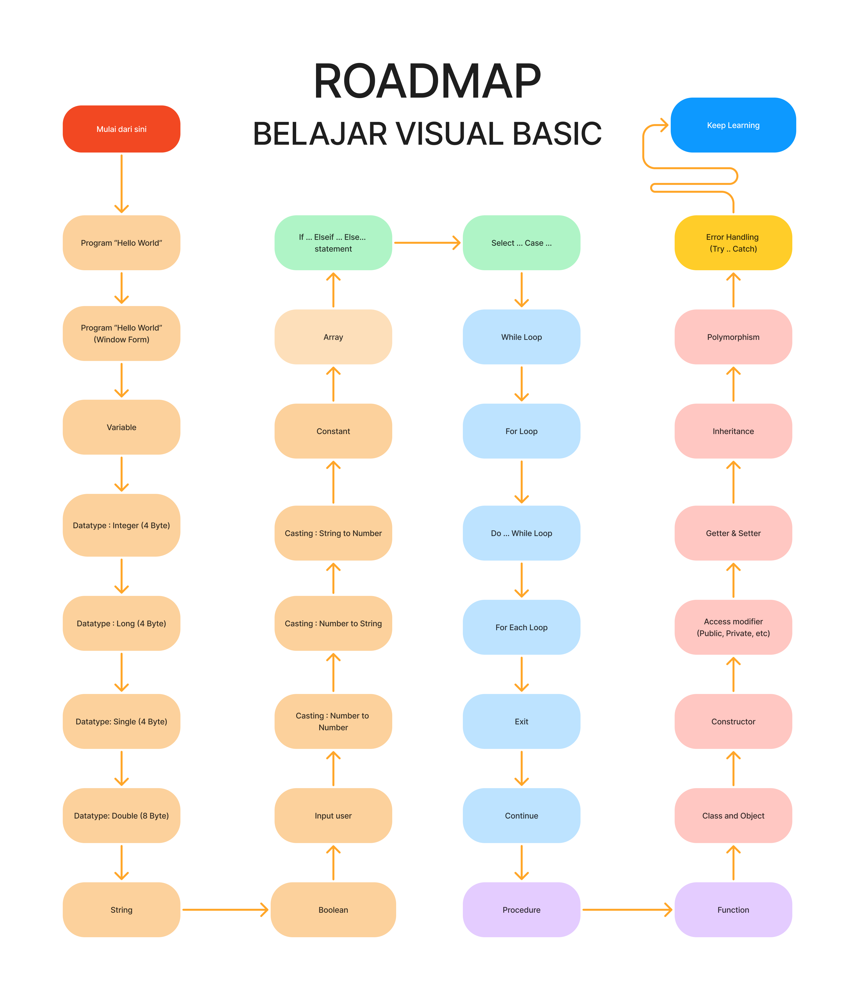

# BELAJAR VISUAL BASIC

Repository ini berisi perjalanan saya belajar visual basic dari nol. Repository ini diharapkan dapat menjadi media belajar bersama atau setidaknya menjadi tempat saya pribadi mengingat ingat dasar pemrograman.

## Roadmap

Repositori ini dibuat berdasarkan roadmap yang saya buat ketika belajar sebuah bahasa pemrograman baru. Adapun roadmap belajar saya pada repository ini digambarkan pada gambar di bawah ini.

